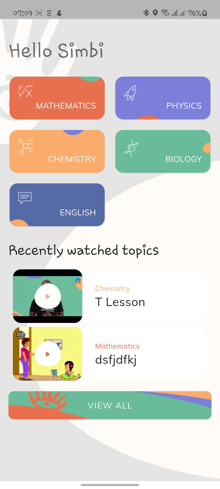
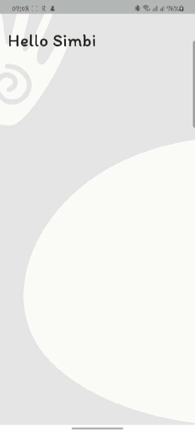
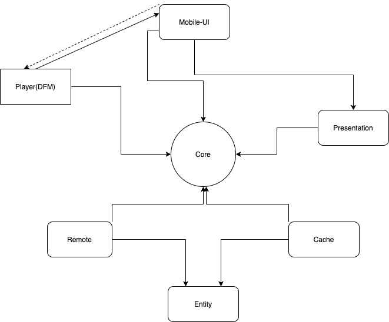

# Introduction

**Akwukwo**(which means book in [igbo](https://en.wikipedia.org/wiki/Igbo_people) language) is an e-learning platform that allows student watch tutorials in video formats 




## Architecture

This project uses clean architecture at it's base and uses MVVM at it's UI level, for maximum decoupling of components i organised the app's code into 7 modules, namely **entity, core, cache, remote, presentation, mobile-ui, and player.** 

Also as a step to make the app's UI more decoupled i made use of single-activity architecture, which means my app only uses 1 activity and every other screen is a fragment, navigating the app is also decoupled i achieved this by grouping every UI(fragment) that are connected or related into a the same navigation graph this allows me to re-use a set of screens(navigation) somewhere else and even in other dynamic modules that depends on the module...

 



architecture overview 

1. **Entity:** This is the ****inner most part of the application and it basically defines interfaces for the module that deals with data manipulation such as the **cache** and the **remote**, it also defines classes called **usecase** that represents an action a user can perform(e.g saving or bookmarking a video)
2. **Remote**: This layer handles networking, it uses **retrofit** for this functionality 
3.  **Cache**: Anything related to saving and retrieving data from the the device storage(database and preferences) is done here, it uses **Room** and android **Sharepreference** to deliver this functionality
4. **Core**: This layer serves as the centre  of the application**,** all app resources used by UI modules are stored here, such  as **drawables, values(strings, values, themes, styles etc..), colors ...** even non-ui modules make use of this module because it provides some of the libraries used by them and also some utility code, this module also contains code that can be useful to other modules such as **base classes, util classes etc ...** 
5. **Presentation**: This is a UI layer of the application, it's function is to define **view-models** and data models for other UI modules
6. **Mobile-ui**: This layer contains **activities**, **fragments**, **list views adapters**, **custom views**, animation related code etc.. UI data models and mappers can also be written here but i want to make it less verbose so i used the data models provided by the **presentation** module
7. **Player**: This layer handles video playbacks, it interact with code from **exoplayer** library

  

## Basic overview

This application uses the offline first approach, when the app is first launched it gets the data from the backend then store this data in the database it also records the time that this happened. Data is only valid for one hour when this time is elapsed and the user launch the app it loads the data again from the backend and then updates it locally, UI related modules are only required to read data from the database this data comes as a stream(such as RX observables or coroutines flows) and it's read from the UI through observable classes(such as Livedata and stateflow) this allows the UI to get updated as soon as there is a change in the local data storage(such as Datastore or Room)

The player is also abstracted into a separate module, i used an install-time dynamic module for this, just to showcase how DFMs works with the base application. this separation is inspired by the fact that in the future other UI modules might also need a media player

Whenever a new lesson is played it stores it in the recents table in the app database, navigating back to the dashboard gets the updated value and updates the UI accordingly.

## Theming & Styling

Resources for these can be found in the core module you can find theme in **themes.xml** and styles in **styles.xml** under the values resource folder, the application is themed in such a way that it takes little efforts to customise

```jsx
<style name="Base.Akwukwo" parent="Theme.MaterialComponents.Light.NoActionBar">
.....
</style>

<!--Extend this whenever you want to create a new theme to use-->
    <style name="Akwukwo" parent="Base.Akwukwo"/>

<style name="Akwukwo.Main" parent="Akwukwo">
        <!--Main App colors-->
        <item name="colorPrimary">@color/akwukwo_white</item>
        <item name="colorPrimaryVariant">@color/akwukwo_gray</item>
        <item name="colorSecondary">@color/akwukwo_white</item>
        <item name="colorSecondaryVariant">@color/akwukwo_white</item>
</style>

<!--By theming this way it's more easy to have different primary and secondary colors
E.G -->

<!-- This is way to build another app theme, that can be used in another activity or fragment-->
<style name="Akwukwo.Red" parent="Akwukwo">
...
</style>
```

The global UI component themes, such as **button**, **toolbars**, and **platform styles(e.g status bar, navigation bar), fonts, shape, motions** are customised from the base theme, every other additional theming attributes are added by extending this base

To change the themed color one can extend **Akwukwo** theme, to add a dark theme one can create a dark variant of this **theme.xml** file, then extend the **Base.Akwukwo** to adapt the UI components for the dark theme.

Very easy to customise...

## Dependency management

Dependencies are managed across the multiple modules using **kotlin gradle dsl**

## Libraries

- Data: Saving data is done with [Room database/ORM](https://developer.android.com/training/data-storage/room), data mapping from json to objects is done with [Gson](https://github.com/google/gson)
- Networking: This done using [retrofit](https://square.github.io/retrofit/)
- Navigation: Navigating the app is done using jetpack [navigation component](https://developer.android.com/guide/navigation)
- Dependency Injection: This is done using [dagger 2](https://dagger.dev/) together with the [android module](https://github.com/google/dagger)
- UI Leverage: The UI components heavily relies on the [material design libraries](https://material.io/components?platform=android)
- Image Loading: This is done using [Glide](https://github.com/bumptech/glide)
- Media playback: [exoplayer](https://exoplayer.dev/) was used for this
- Asynchronous: This is handled using kotlin [coroutines/flow](https://github.com/Kotlin/kotlinx.coroutines)

## Testing

Each module of the app is tested using testing frameworks provided by [jetpack test package](https://developer.android.com/jetpack/androidx/releases/test#1.3.0), [Mockk](https://mockk.io/) for mocking [konveyor](https://github.com/Vacxe/Konveyor) to generate random objects, [truth](https://truth.dev/) was used for assertions
